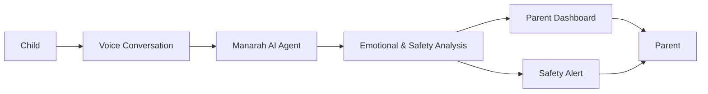
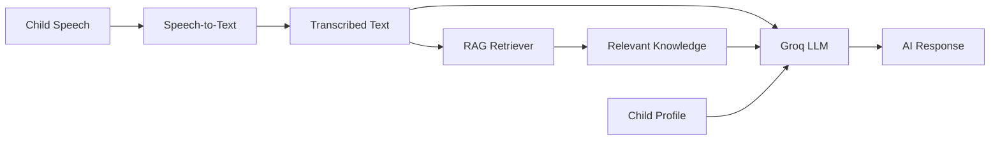
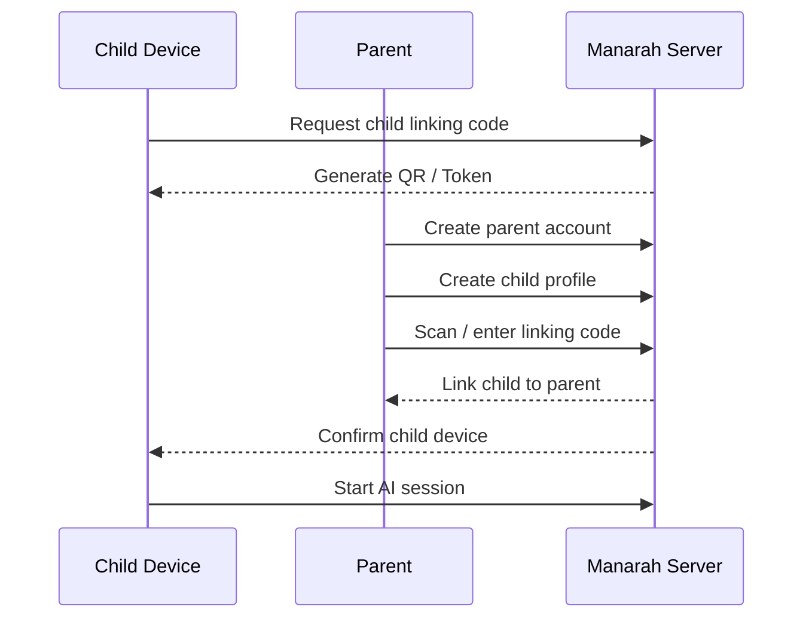
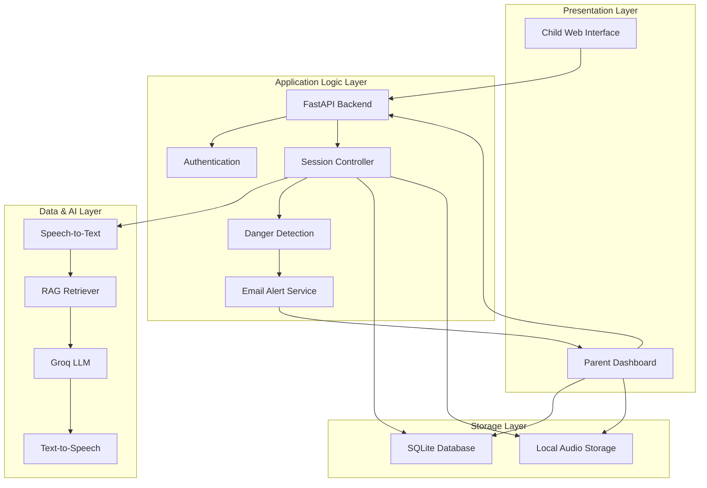
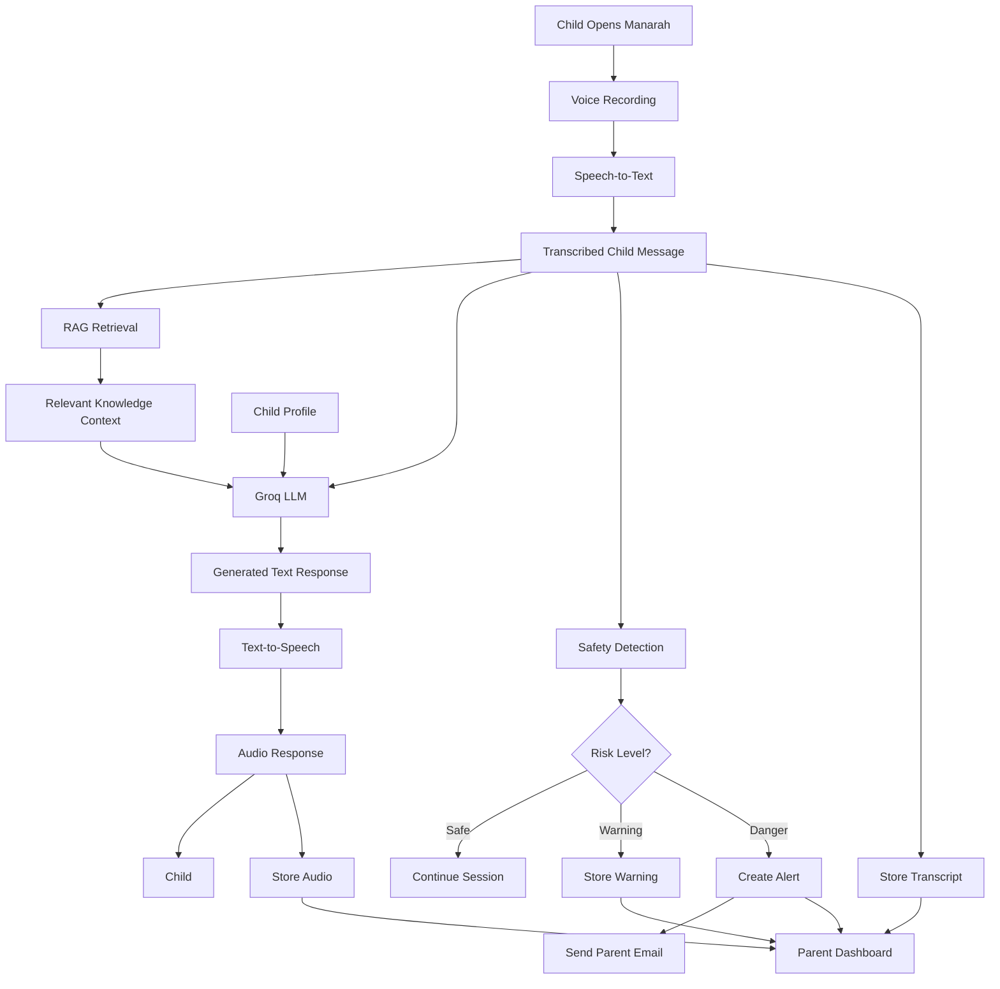
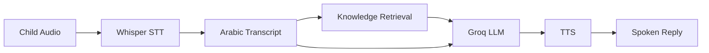
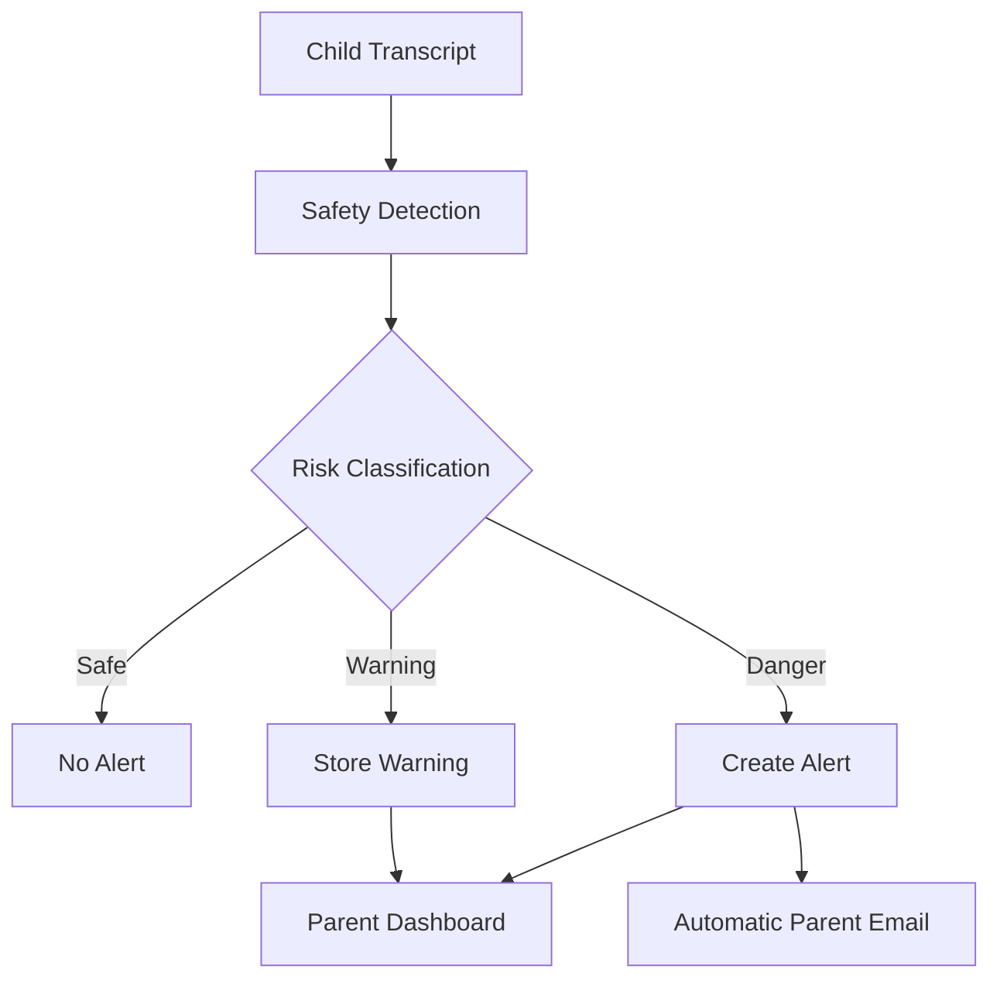
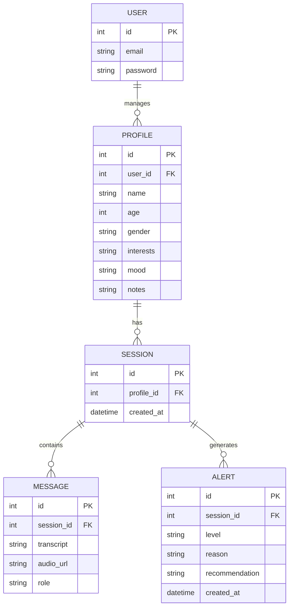
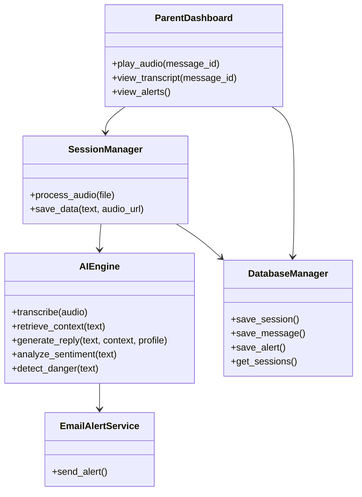

# Manarah — AI Voice Companion for Children

<p align="center">
  
</p>

<h3 align="center">
  A voice-first AI companion designed to support early emotional distress detection in children.
</h3>

<p align="center">
  <strong>Talk naturally. Understand emotions. Keep parents informed.</strong>
</p>

---

## Overview

**Manarah** is a voice-first AI companion designed for children, with a focus on early identification of emotional distress and stronger parental involvement.

The project addresses a simple but important problem: **children may struggle to explain their feelings to their parents, especially when they are afraid of receiving a strong reaction or being misunderstood.**

Instead of requiring children to type, Manarah allows them to **speak naturally**. The system processes the child's speech, generates an age-appropriate response, analyzes emotional indicators, stores the session, and provides the parent with a detailed monitoring dashboard.

The system is designed around a **Full Parental Supervision** model. Parents can review their child's session history, transcripts, audio recordings, emotional trends, generated recommendations, and safety alerts.

> **Important:** Manarah is a graduation-project demo and is **not a medical diagnostic system**. Its purpose is early indication, monitoring, and supporting parents in deciding when further attention may be appropriate.

---

## Why Manarah?

Children do not always communicate their emotions in the same way adults do.

A child might say:

> "My mom shouted at me."

An AI system could interpret this as evidence of abuse or rejection without understanding the context.

However, the actual situation could be completely different. The parent may have shouted because the child was doing something dangerous, and the reaction may have come from fear and concern rather than anger or rejection.

This is one of the reasons Manarah does **not** treat the AI's interpretation as an absolute truth.

Instead, the system combines:

* AI interaction with the child
* Emotional indicator analysis
* Session history
* Parent supervision
* Parent notes
* Safety detection
* Evidence-based RAG context
* Automated alerts when serious risk indicators appear

The goal is to provide parents with **more information, not a final diagnosis**.

---

## Core Idea



The system creates a continuous loop between the child's interaction and parental supervision.

---

# Key Features

### 🎙️ Voice-First Interaction

Children communicate with Manarah by speaking instead of typing.

The system processes Arabic speech and generates a spoken response, making the interaction more natural for children between approximately 5 and 12 years old.

### 🧠 AI Conversation Engine

The conversational engine uses a Groq-hosted large language model to generate supportive, age-appropriate responses.

The child's profile can provide contextual information such as:

* Name
* Age
* Gender
* Interests
* General mood
* Parent notes

This allows the agent to personalize its responses.

### 📚 Retrieval-Augmented Generation

Manarah uses a curated knowledge base to retrieve relevant psychological and educational context before generating certain responses.

This helps ground the system's guidance in the project's collected reference material rather than relying entirely on the language model's internal knowledge.



---

### 📊 Emotional Analysis

After sessions, Manarah analyzes the child's conversation for emotional indicators.

The dashboard can display indicators such as:

* Joy
* Sadness
* Fear
* Anger
* Overall status

The analysis is intended as an **indicator**, not a medical diagnosis.

Parents can also inspect the session content to understand why an emotional indicator changed.

For example:

> A decrease in the joy indicator may be associated with statements expressing fear, loneliness, bullying, or sadness.

---

### 🛡️ Safety & Danger Detection

Manarah contains a dedicated safety detection layer.

The child's original message can be classified into:

| Level     | Meaning                                         |
| --------- | ------------------------------------------------ |
| `safe`    | No clear danger detected                        |
| `warning` | Concerning content requiring parental attention |
| `danger`  | Serious safety concern                          |

Examples of warning indicators include bullying, severe fear, isolation, or school-related distress.

Danger indicators can include expressions related to self-harm or wanting to die.

When a serious concern is detected, the system can:

1. Store the alert.
2. Associate it with the child's session.
3. Generate a recommendation.
4. Automatically notify the registered parent by email.

---

### 📧 Automatic Parent Alerts

If a serious safety indicator is detected, the registered parent's email can receive an alert containing relevant information such as:

* Child information
* Detected risk level
* Child's statement
* AI interpretation
* Recommended action

This creates a direct connection between the AI monitoring system and the responsible parent.

---

### 👨‍👩‍👧 Full Parental Supervision

Unlike systems where the child's conversation remains hidden from parents, Manarah follows a **Full Parental Supervision** approach.

Parents can access:

* Session history
* Full transcripts
* Original audio recordings
* Emotional analysis
* Safety alerts
* AI-generated recommendations
* Parent notes

This is a central design decision of the project because the system is intended for children.

---

### 📝 Parent Notes

Parents can add notes to sessions.

This is useful because the AI may interpret a child's statement incorrectly without knowing the complete family context.

For example, a parent can record an explanation about why a particular incident happened.

The current version stores these notes as part of the monitoring workflow. Future versions could use these notes to improve personalization and contextual interpretation.

---

### 📱 Parent Dashboard

The parent dashboard provides a centralized view of the child's activity.

Parents can review:

* Child profile
* Session history
* Audio recordings
* Transcripts
* Emotional trends
* Safety alerts
* Session recommendations
* Parent notes
* Support contacts

---

### 🔗 Child Device Linking

A parent can create a child profile and link the child's device using a generated QR code.



This allows the child to access the companion with a limited child-facing interface while the parent maintains supervision.

---

# System Architecture

The system follows a **Client-Server architecture** with three main layers, as described in the project's system design.



The architecture separates the user interfaces from the heavy AI processing. The child and parent interfaces communicate with the FastAPI backend, while AI services and storage are handled server-side.

---

# Program Flow

The main conversational pipeline follows the design described in Chapter 5.



The project uses a split process:

**Response Path**

`Speech → STT → RAG → LLM → TTS → Child`

**Monitoring Path**

`Transcript + Audio → Storage → Analysis → Dashboard → Parent`

This separation allows the child to receive the conversational response while the system simultaneously prepares monitoring information for the parent.

---

# AI Processing Pipeline



The AI pipeline combines speech recognition, retrieval, language generation, and speech synthesis.

---

# Safety Pipeline



The safety layer is intentionally separated from the conversational generation process.

This allows the project to treat **conversation generation** and **child safety monitoring** as two related but distinct responsibilities.

---

# Database Design

The project uses SQLite for lightweight local data management.

The database design contains the main entities required for parent accounts, child profiles, sessions, messages, and safety alerts.



The database structure supports the hierarchical relationship between parents and children while keeping session messages and safety alerts associated with the correct child.

---

# UML / Core Backend Classes

The backend follows a modular structure separating session orchestration, AI processing, and parent monitoring.



The `SessionManager` acts as the central orchestrator of the session lifecycle, while the AI engine handles the processing pipeline.

---

# Major Modules

| Module                      | Main Responsibility                                    |
| ---------------------------- | ------------------------------------------------------- |
| Child Interaction Interface | Voice-based interaction with the child                  |
| Parent Monitoring Dashboard | Session monitoring and emotional analytics              |
| Core AI Engine               | Speech processing, RAG, LLM, safety detection and TTS   |
| Backend Services              | API requests, authentication, storage and alerts        |

### Child Interaction Interface

* Voice Recorder
* Animated AI Interface
* Audio Player
* QR Code / Device Linking

### Parent Monitoring Dashboard

* Authentication
* Audio Playback
* Transcript Viewer
* Analytics
* Alerts
* Support Contacts

### Core AI Engine

* Speech-to-Text
* RAG Retriever
* Groq LLM
* Emotional Analysis
* Danger Detection
* Text-to-Speech

### Backend Services

* FastAPI API
* Session Controller
* SQLite Database Manager
* Local Audio Storage
* Email Alert Service

---

# Technology Stack

| Layer               | Technology                |
| -------------------- | -------------------------- |
| Frontend             | HTML, CSS, JavaScript      |
| Backend               | Python, FastAPI            |
| LLM                   | Groq API                   |
| Safety Model           | Groq-hosted safety model  |
| Speech-to-Text        | OpenAI Whisper              |
| Text-to-Speech         | OpenAI TTS                 |
| Knowledge Retrieval    | RAG                        |
| Database                | SQLite                     |
| Email Alerts            | SMTP                       |
| Authentication          | Backend authentication     |
| Architecture             | Client-Server               |

---

# Repository Structure

```text
Manarah/
│
├── main.py
├── database.py
├── db_helper.py
│
├── llm_groq.py
├── rag_retriever.py
├── whisper_stt.py
├── tts_openai.py
├── email_alert.py
│
├── rag/
│   └── mental_health.txt
│
├── scripts/
│   ├── convert_rag.py
│   └── seeder.py
│
├── static/
│   ├── index.html
│   ├── login.html
│   ├── parent.html
│   ├── add_child.html
│   ├── child.html
│   ├── child_welcome.html
│   ├── sessions.html
│   └── analysis.html
│
├── screenshots/
│   ├── login.png
│   ├── Main Entry.png
│   ├── add child.png
│   ├── Device Linking.png
│   ├── Child Voice Interaction.png
│   ├── Parent Dashboard.png
│   ├── Session Review.png
│   ├── Emotional Analysis.png
│   ├── Safety Alert.png
│   └── Support and Assistance Channels.png
│
├── requirements.txt
├── .env.example
├── .gitignore
└── README.md
```

---

# Getting Started

## 1. Clone the repository

```bash
git clone <YOUR_REPOSITORY_URL>
cd Manarah
```

## 2. Create a virtual environment

### Windows

```powershell
python -m venv .venv
.venv\Scripts\activate
```

### macOS / Linux

```bash
python3 -m venv .venv
source .venv/bin/activate
```

## 3. Install dependencies

```bash
pip install -r requirements.txt
```

## 4. Configure environment variables

Create a local `.env` file based on `.env.example`.

```env
GROQ_API_KEY=

GROQ_MODEL=openai/gpt-oss-20b
GROQ_SAFETY_MODEL=openai/gpt-oss-safeguard-20b

OPENAI_API_KEY=

ALERT_EMAIL_FROM=
ALERT_EMAIL_PASSWORD=
```

**Never commit your real `.env` file or API keys to GitHub.**

The repository includes `.env.example` so developers can understand which environment variables are required.

## 5. Run the application

```bash
uvicorn main:app --reload
```

Then open the local application in a browser.

---

# Knowledge Base / RAG

The project includes a curated knowledge base under:

```text
rag/
```

The retriever uses this material to provide relevant context to the AI during conversations.

The purpose of the RAG layer is to make responses more grounded in the project's collected educational and psychological references.

Future versions can expand the knowledge base with additional verified material from recognized health and psychological organizations.

---

# Parental Support & Emergency Contacts

The dashboard includes access to support resources for situations requiring additional assistance.

The project documentation identifies the following Saudi support channels:

| Service                                     |        Number |
| --------------------------------------------- | -------------: |
| Child Support Line                            |    **116111** |
| Ministry of Health                            |       **937** |
| Saudi Red Crescent                            |       **997** |
| Unified Emergency                             |       **911** |
| Domestic Violence & Abuse Reports             |      **1919** |
| National Center for Mental Health Promotion   | **920033360** |

These resources are presented as support options and do not replace professional medical or emergency services.

---

# Testing

The project includes scenario-based testing for sensitive cases such as bullying and emotional distress.

The documented end-to-end pipeline is:

```text
Voice Recording
      ↓
Speech-to-Text
      ↓
LLM Processing
      ↓
Text-to-Speech
      ↓
Emotional Mapping
      ↓
Parent Dashboard
```

The project documentation reports an average response latency of approximately **2.8 seconds** during system testing.

---

# Screenshots

The screenshots below walk through the complete Manarah experience — from a parent creating an account, to a child having a voice conversation, to the parent reviewing emotional trends and safety alerts.

### 1. Login

<p align="center">
  
</p>

The parent authentication screen. Parents sign in to access the monitoring dashboard and manage their children's profiles.

---

### 2. Main Entry

<p align="center">
  
</p>

The main Manarah entry page where the user chooses between the parent and child experience.

---

### 3. Add Child

<p align="center">
  
</p>

Parents create a profile for each child, including name, age, gender, and interests. This information personalizes the AI's conversation style.

---

### 4. Device Linking

<p align="center">
  
</p>

The QR-code linking process between the parent's account and the child's device, allowing the child to access a limited, safe interface.

---

### 5. Child Voice Interaction

<p align="center">
  
</p>

The child speaking with Manarah. This demonstrates the project's main differentiator: **voice-first interaction**.

---

### 6. Parent Dashboard

<p align="center">
  
</p>

The parent's dashboard, showing an overview of the child's profile, emotional indicators, session history, and alert status. This is one of the most important screenshots.

---

### 7. Session Review

<p align="center">
  
</p>

A detailed session view including the transcript, the AI-generated recommendation, and any parent notes attached to the session. This screenshot demonstrates the project's supervision model.

---

### 8. Emotional Analysis

<p align="center">
  
</p>

The emotional trend view across multiple sessions, showing how joy, sadness, fear, and anger indicators evolve over time.

---

### 9. Safety Alert

<p align="center">
  
</p>

A dashboard alert generated when the safety detection layer identifies a `warning` or `danger` level concern in the child's conversation.

---

### 10. Support and Assistance Channels

<p align="center">
  
</p>

The dashboard's list of official Saudi support and emergency contact channels, available to parents at any time.

---

# Project Design Diagrams

The repository documentation follows the system design presented in Chapter 5 of the project report:

* System Architecture
* Program Flow
* Major Modules
* Entity Relationship Diagram
* UML Class Diagram

These diagrams describe the separation between the child interface, parent dashboard, FastAPI backend, AI services, database, local storage, and alert system.

---

# Current Limitations

Manarah is currently a **working graduation-project demo**, rather than a production clinical platform.

Current limitations include:

* AI interpretation can be context-dependent.
* Emotional scores are indicators rather than clinical measurements.
* Language models may misunderstand ambiguous statements.
* Arabic dialect variation can affect speech recognition and response quality.
* External AI APIs introduce dependency on internet connectivity and API availability.
* API usage and model limits can affect system availability.
* The current system should not be used as a replacement for professional psychological or medical assessment.

The parent supervision layer is therefore an essential part of the system rather than an optional feature.

---

# Future Development

Potential future improvements include:

* Improved Saudi Arabic dialect support
* Better contextual understanding of parent notes
* More advanced emotional trend analysis
* Larger and more rigorously curated RAG knowledge base
* Additional safety classification techniques
* Improved Arabic text-to-speech quality
* More advanced personalization
* Wearable / IoT integration
* Gamification
* Expanded multi-child management
* Stronger privacy and production-grade security
* Professional evaluation and validation

---

# Project Philosophy

Manarah is built around a simple principle:

> **AI should not replace the parent. It should help the parent understand the child earlier.**

The system is therefore designed as a bridge between:

**Child → AI Companion → Analysis → Parent → Appropriate Action**

Rather than treating the AI's interpretation as absolute truth, Manarah provides parents with the child's actual conversation, audio, emotional indicators, alerts, and contextual recommendations.

---

# Disclaimer

Manarah is an academic graduation-project prototype.

It is designed to support **early awareness and parental monitoring** and is **not a medical diagnostic tool, therapist, or replacement for qualified healthcare professionals**.

If a child may be in immediate danger, parents should contact the appropriate emergency or professional support service.

---

# Authors

**Manarah Graduation Project**

Developed as an academic project focused on:

* Artificial Intelligence
* Voice Interaction
* Arabic NLP
* Child Safety
* Emotional Analysis
* Retrieval-Augmented Generation
* Parental Monitoring

---

## Project Status

**Status: Working Demo / MVP**

The current prototype demonstrates the complete core workflow:

```text
Child Voice
    ↓
Speech Recognition
    ↓
AI Understanding
    ↓
RAG Context
    ↓
AI Response
    ↓
Voice Response
    ↓
Emotional Analysis
    ↓
Safety Detection
    ↓
Database Storage
    ↓
Parent Dashboard
    ↓
Email Alert when required
```
